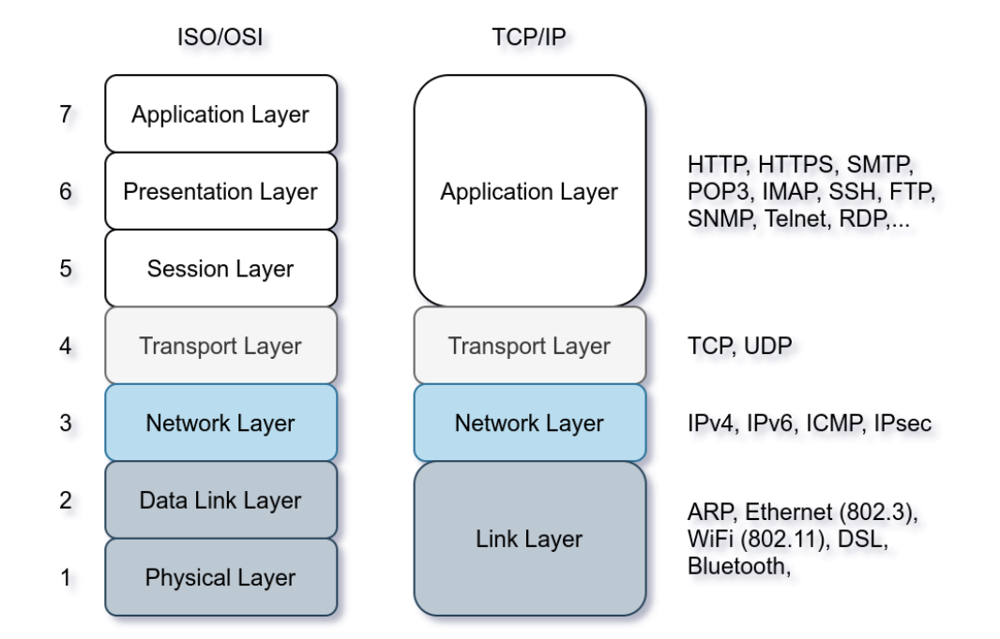
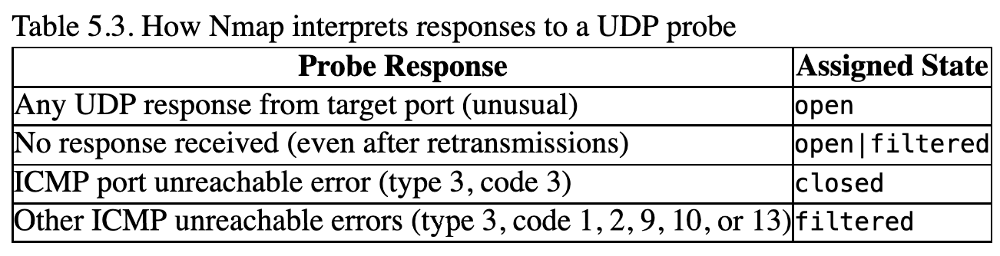

From what I've learned, nmap is one of the first tools that are employed in many pentest/ctf/hacking scenarios. Naturally, I've decided to understand what is nmap good at and what's under the hood.

### OSI model


# NMAP scan types
- ARP scan: This scan uses ARP requests to discover live hosts. ARP maps an IP with a MAC address. A normal user doesn't need to know the MAC address of a machine outside of their subnet. This is why ARP packages stay within the subnet and higher protocols in the stack use the router to leave the subnet.
- ICMP scan: This scan uses ICMP requests to identify live hosts
    - Type 8 (Echo) and Type 0 (Echo Reply).
- TCP/UDP scan:
    - TCP: SYN probing
    - UDP (https://nmap.org/book/scan-methods-udp-scan.html): 

### "Stealth" scan: -sS
- SYN, SYN/ACK, RST

### "Connect" scan: -sT
- SYN, SYN/ACK, ACK, RST

# ipv4
- 32 bits: byte.byte.byte.byte
- A byte can range from 0 to 255
- Classes:
    - A: `0b'0X-'`/// `0` to `127` prefix
        - Private network addresses: 
            `10.0.0.0` to `10.255.255.255`
    - B: `0b'10-'`/// `128` to `191` prefix
        - Private network addresses: 
            `172.16.0.0` to `172.31.255.255`
    - C: `0b'110-'`/// `192` to `223` prefix
        - Private network addresses: 
            `192.168.0.0` to `192.168.255.255`
    - D: `0b'1110-`/// `224` to `239` prefix (Multicast)
    - E: `0b'1111-'`/// `240` to `255` prefix (Future and experimental)
    - Localhost IP: `127.0.0.0` to `127.255.255.255`

# Wireshark look at NMAP
- `TCP completeness field`. Really interesting feature to use a filter to capture the essence of a TCP conversation. Wireshark adds the values assigned to each flag and displays the result in the TCP completeness field. Therefore, the state of a conversation can be uniquely identified by the value of the TCP completeness field. A very suspicious (`nmap -sT`) conversation could be: `SYN`, `SYN-ACK`, `ACK` and `RST`. 1 + 2 + 4 + 32 = 39. In binary it becomes even more clear:
```
SYN     | SYN-ACK   | ACK    | RST
000001  | 000010    | 000100 | 100000 = 100111
```
```text
1   SYN     000001
2   SYN-ACK 000010 
4   ACK     000100
8   DATA    001000
16  FIN     010000
32  RST     100000
```

# Summary from tutorial website
https://tryhackme.com/room/nmap01
```
Scan Type               Example Command
--------------------------------------------------------------
ARP Scan                sudo nmap -PR -sn MACHINE_IP/24
ICMP Echo Scan          sudo nmap -PE -sn MACHINE_IP/24
ICMP Timestamp Scan     sudo nmap -PP -sn MACHINE_IP/24
ICMP Address Mask Scan 	sudo nmap -PM -sn MACHINE_IP/24
TCP SYN Ping Scan 	    sudo nmap -PS22,80,443 -sn MACHINE_IP/30
TCP ACK Ping Scan 	    sudo nmap -PA22,80,443 -sn MACHINE_IP/30
UDP Ping Scan 	        sudo nmap -PU53,161,162 -sn MACHINE_IP/30

Remember to add -sn if you are only interested in host discovery without port-scanning. Omitting -sn will let Nmap default to port-scanning the live hosts.
Option 	    Purpose
--------------------------------------
-n 	        no DNS lookup
-R 	        reverse-DNS lookup for all hosts
-sn         host discovery only
```